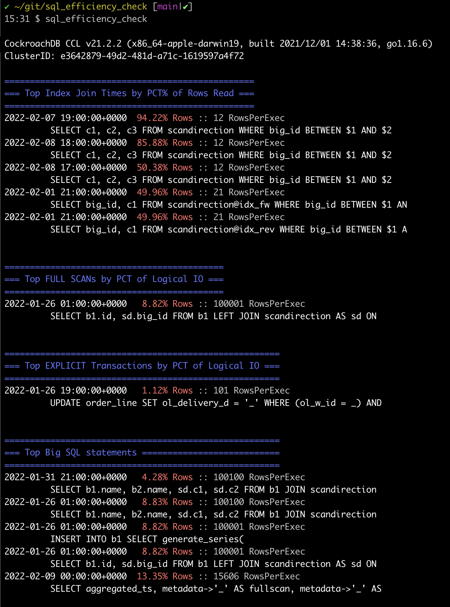

# SQL efficiency checker 

This tool uses the `crdb_internal.statement_statistics` to analyze the various sql statements. Efficiency is analyzed to determine if the statements could be better optimized.  This tool has several options expand control the verbosity of the report.


## Options

```bash
✔ ~/git/sql_efficiency_check [main|✚ 1…1]
10:54 $ sql_efficiency_check -help
Usage of sql_efficiency_check:
  -conn string
    	database connection string (default "postgresql://root@localhost:26257/defaultdb?sslmode=disable")
  -maxStmt int
    	the maximum number of SQL Statements to display for each issue (default 5)
  -showFull
    	Print the FULL statement
  -showPlans
    	Print the Sampled Query Plan
```

If you have a fully secure cluster embed the username, password, and certificate paths in the `-conn` string like so:

```bash
sql_efficiench_check -conn 'postgresql://my_name:my_password@my_ipaddress:26257/defaultdb?sslmode=verify-full&sslrootcert=$HOME/Library/CockroachCloud/certs/my_ca.crt'
```

## Default Output

With default options the data is output as shown below with colors to indicate the severity of various efficiency issues:

