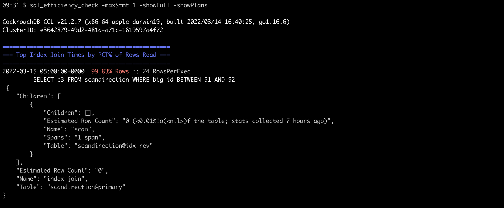

# SQL efficiency checker 

This tool uses the `crdb_internal.statement_statistics` to analyze the various sql statements. Efficiency is analyzed to determine if the statements could be better optimized.  This tool has several options expand control the verbosity of the report.

## How to install this GO app 
This section outlines steps to install this `sql_efficiency_check` app on Mac. 

1. Download and install [GO](https://go.dev/doc/install)
2. From the command line in the `sql_efficiency_check` directory, run the go build command (`$ go build`) to compile the code into an executable. 
  - You've compiled the application into an executable so you can run it. But to run it currently, your prompt needs either to be in the executable's directory, or to specify the executable's path.
  - Next, you'll install the executable so you can run it without specifying its path.
3. Run `$ go install` to move the binary to app directory.
4. Discover the Go install path, where the go command will install the current package.
  - You can discover the install path by running the go list command, as in the following example: `$ go list -f '{{.Target}}'`
  - For example, the command's output might say `/Users/bryankwon/go/bin/sql_efficiency_check`, meaning that binaries are installed to `/Users/bryankwon/go/bin`. You'll need this install directory in the next step.
5. Add the Go install directory to your system's shell path. That way, you'll be able to run your program's executable without specifying where the executable is.
  - EXAMPLE: `$ export PATH=$PATH:/Users/bryankwon/go/bin`
6. Run your application by simply typing its name. To make this interesting, open a new command prompt and run the hello executable name in some other directory.

## Options

```bash
$ sql_efficiency_check -help

Usage of ./sql_efficiency_check:
  -conn string
    	database connect string (default "postgresql://root@localhost:26257/defaultdb?sslmode=disable")
  -http string
    	a bind string for the metrics server (default ":8181")
  -lastHr
    	Sample "now() - INTERVAL '1hr'"
  -maxStmt int
    	the maximum number of SQL Statements to display for each issue (default 5)
  -metricServer
    	Run Metric Server instead of Report
  -showFull
    	Print the FULL statement
  -showPlans
    	Print the FULL Query Plan
```

If you have a fully secure cluster embed the username, password, and certificate paths in the `-conn` string like so:

```bash
sql_efficiench_check -conn 'postgresql://my_name:my_password@my_ipaddress:26257/defaultdb?sslmode=verify-full&sslrootcert=$HOME/Library/CockroachCloud/certs/my_ca.crt'
```

## Default Output "Report Mode"

With default options the data is output as shown below with colors to indicate the severity of various efficiency issues:


...


This highlights the top SQL statements that contribute to distributed SQL fan-out, explicit transactions, and FULL scans.  These can be adjusted by better indexes, DDL, and application restructuring.  To provide more details regarding problem areas you can use the options to expose the FULL SQL text and explain plans for the problem statements.

The following statement uses:
- `-maxStmt` option to limit the number of statements in each category 
- `-showFull` option to display the sql statement
- `-showPlans` to display the `EXPLAIN` plan

```bash
$ sql_efficiency_check -maxStmt 1 -showFull -showPlans
```

**Example output of a few sections are displayed below.....**



## Metric Server

In order to record the efficiency over time, there is option of running in `-metricServer` mode.  This samples the Logical IO and tags all Logical IO as part of an Index Join, Full Scan, or Explicit transaction.  While these can not be always avoided, they are known to be less efficient than LIO that does not involve these operations.  


```bash
$ sql_efficiency_check -metricServer

CockroachDB CCL v21.2.2 (x86_64-apple-darwin19, built 2021/12/01 14:38:36, go1.16.6)
ClusterID: e3642879-49d2-481d-a71c-1619597a4f72

Running Prometheus Metric Server
2022/02/23 17:28:58 listening on [::]:8181
2022/02/23 17:29:02 RESET COUNTERs due to AggInterval change
2022/02/23 18:00:17 RESET COUNTERs due to AggInterval change
2022/02/23 19:00:13 RESET COUNTERs due to AggInterval change
```


### Dashboard output

Once the `-metricServer` is running, Prometheus can sample from the `-http` port.  Finally, this allows Grafana to display the SQL efficiency [Dashboard](SQLEfficiencyDashboard-1645677578406.json) counters along with application and other CockroachDB metrics. Looking at efficiency data over time can be real powerful as it can help identify patterns or changes in the application and help quickly identify potential issues.

Below is an example output:


