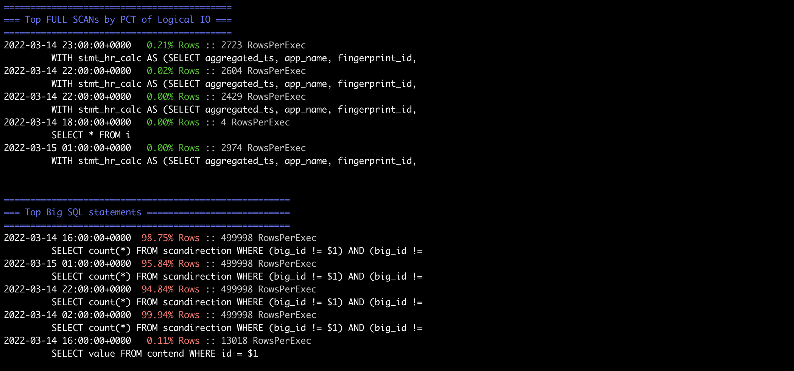

# SQL efficiency checker 

This tool uses the `crdb_internal.statement_statistics` to analyze the various sql statements. Efficiency is analyzed to determine if the statements could be better optimized.  This tool has several options expand control the verbosity of the report.


## Options

```bash
$ sql_efficiency_check -help

Usage of ./sql_efficiency_check:
  -conn string
    	database connect string (default "postgresql://root@localhost:26257/defaultdb?sslmode=disable")
  -http string
    	a bind string for the metrics server (default ":8181")
  -lastHr
    	Sample "now() - INTERVAL '1hr'"
  -maxStmt int
    	the maximum number of SQL Statements to display for each issue (default 5)
  -metricServer
    	Run Metric Server instead of Report
  -showFull
    	Print the FULL statement
  -showPlans
    	Print the FULL Query Plan
```

If you have a fully secure cluster embed the username, password, and certificate paths in the `-conn` string like so:

```bash
sql_efficiench_check -conn 'postgresql://my_name:my_password@my_ipaddress:26257/defaultdb?sslmode=verify-full&sslrootcert=$HOME/Library/CockroachCloud/certs/my_ca.crt'
```

## Default Output "Report Mode"

With default options the data is output as shown below with colors to indicate the severity of various efficiency issues:


...


This highlights the top SQL statements that contribute to distributed SQL fan-out, explicit transactions, and FULL scans.  These can be adjusted by better indexes, DDL, and application restructuring.  To provide more details regarding problem areas you can use the options to expose the FULL SQL text and explain plans for the problem statements.

The following statement uses:
- `-maxStmt` option to limit the number of statements in each category 
- `-showFull` option to display the sql statement
- `-showPlans` to display the `EXPLAIN` plan

```bash
$ sql_efficiency_check -maxStmt 1 -showFull -showPlans
```

**Example output of a few sections are displayed below.....**


## Metric Server

In order to record the efficiency over time, there is option of running in `-metricServer` mode.  This samples the Logical IO and tags all Logical IO as part of an Index Join, Full Scan, or Explicit transaction.  While these can not be always avoided, they are known to be less efficient than LIO that does not involve these operations.  


```bash
$ sql_efficiency_check -metricServer

CockroachDB CCL v21.2.2 (x86_64-apple-darwin19, built 2021/12/01 14:38:36, go1.16.6)
ClusterID: e3642879-49d2-481d-a71c-1619597a4f72

Running Prometheus Metric Server
2022/02/23 17:28:58 listening on [::]:8181
2022/02/23 17:29:02 RESET COUNTERs due to AggInterval change
2022/02/23 18:00:17 RESET COUNTERs due to AggInterval change
2022/02/23 19:00:13 RESET COUNTERs due to AggInterval change
```

### Prometheus Endpoints
The `stmt_stats` counter vector defines the `Optimized`, `explicit`, `full`, and `ijoin` counters which represent the number of rows read or "Logical IO" for each of the SQL methods.

```bash
19:20 $ curl 127.0.0.1:8181
# HELP promhttp_metric_handler_requests_in_flight Current number of scrapes being served.
# TYPE promhttp_metric_handler_requests_in_flight gauge
promhttp_metric_handler_requests_in_flight 1
# HELP promhttp_metric_handler_requests_total Total number of scrapes by HTTP status code.
# TYPE promhttp_metric_handler_requests_total counter
promhttp_metric_handler_requests_total{code="200"} 54446
promhttp_metric_handler_requests_total{code="500"} 0
promhttp_metric_handler_requests_total{code="503"} 0
# HELP stmt_stats
# TYPE stmt_stats counter
stmt_stats{lio="Optimized"} 21367
stmt_stats{lio="explicit"} 48422
stmt_stats{lio="full"} 0
stmt_stats{lio="ijoin"} 512352
```

### Prometheus prometheus.yml entries

```yaml
global:
  scrape_interval: 10s

scrape_configs:
  - job_name: sql_efficiency_check
    metrics_path: /
    scheme: http
    static_configs:
      - targets: [ '127.0.0.1:8181' ]
```


### Dashboard output

Once the `-metricServer` is running, Prometheus can scrape from the `-http` port.  Finally, this allows Grafana to display the SQL efficiency [Dashboard](SQLEfficiencyDashboard-1645677578406.json) counters along with application and other CockroachDB metrics. Looking at efficiency data over time can be real powerful as it can help identify patterns or changes in the application and help quickly identify potential issues.

Below is an example output:


## Install Instructions

There are several ways to install, compile and deploy this tool.  You can certainly, but build your own like shown in the [DIY](DIY_build.md) instructions.  The easiest way is to simply run the published docker image.

### Running with Docker

This shows you how to run the docker [image](https://hub.docker.com/r/cockroachdb/sql_efficiency_check/tags) deployed to our docker hub.

#### Running Docker Image in Report Mode

This displays the report style output to standard out.

```bash
docker run  -it cockroachdb/sql_efficiency_check:main  -conn postgresql://root@192.168.0.100:26257/defaultdb?sslmode=disable -maxStmt 2
```

#### Running Docker Image as metricServer

This runs the image in `-metricServer` mode so data can be scraped by Prometheus or other services.

```bash
docker run -p 8181:8181 -it cockroachdb/sql_efficiency_check:main  -conn postgresql://root@192.168.0.100:26257/defaultdb?sslmode=disable -metricServer

CockroachDB CCL v22.1.0 (x86_64-pc-linux-gnu, built 2022/05/23 16:27:47, go1.17.6)
ClusterID: 34454c6c-0d95-4625-b8b5-1816bde0e223

Running Prometheus Metric Server
2022/06/23 00:08:42 listening on [::]:8181
2022/06/23 00:08:42 RESET COUNTERs due to AggInterval change
```

So the `8181` default port is exposed outside of docker.  Prometheus can then be pointed to this endpoint scrape data like so:

```bash
curl localhost:8181
# HELP process_cpu_seconds_total Total user and system CPU time spent in seconds.
# TYPE process_cpu_seconds_total counter
process_cpu_seconds_total 0.06
# HELP process_max_fds Maximum number of open file descriptors.
# TYPE process_max_fds gauge
process_max_fds 1.048576e+06
# HELP process_open_fds Number of open file descriptors.
# TYPE process_open_fds gauge
process_open_fds 10
# HELP process_resident_memory_bytes Resident memory size in bytes.
# TYPE process_resident_memory_bytes gauge
process_resident_memory_bytes 1.0375168e+07
# HELP process_start_time_seconds Start time of the process since unix epoch in seconds.
# TYPE process_start_time_seconds gauge
process_start_time_seconds 1.65594292028e+09
# HELP process_virtual_memory_bytes Virtual memory size in bytes.
# TYPE process_virtual_memory_bytes gauge
process_virtual_memory_bytes 7.31369472e+08
# HELP process_virtual_memory_max_bytes Maximum amount of virtual memory available in bytes.
# TYPE process_virtual_memory_max_bytes gauge
process_virtual_memory_max_bytes 1.8446744073709552e+19
# HELP promhttp_metric_handler_requests_in_flight Current number of scrapes being served.
# TYPE promhttp_metric_handler_requests_in_flight gauge
promhttp_metric_handler_requests_in_flight 1
# HELP promhttp_metric_handler_requests_total Total number of scrapes by HTTP status code.
# TYPE promhttp_metric_handler_requests_total counter
promhttp_metric_handler_requests_total{code="200"} 1
promhttp_metric_handler_requests_total{code="500"} 0
promhttp_metric_handler_requests_total{code="503"} 0
# HELP stmt_stats
# TYPE stmt_stats counter
stmt_stats{lio="Optimized"} 944
stmt_stats{lio="explicit"} 0
stmt_stats{lio="full"} 0
stmt_stats{lio="ijoin"} 0
```
